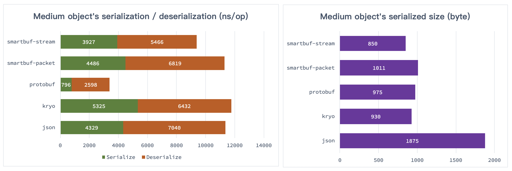

# SmartBuf [](https://travis-ci.org/smartbuf/smartbuf-java) [](https://codecov.io/gh/smartbuf/smartbuf-java)

`smartbuf`是一种新颖、高效、智能、易用的跨语言序列化框架，它既拥有不亚于`protobuf`的高性能，也拥有与`json`相仿的通用性、可扩展性、可调试性等。

与`json`、`xml`类似，`smartbuf`编码后的数据中仍然保留着`schema`信息，
无需预先协定任何数据模型，接收方即可直接完成数据的解码。这个特性赋予了`smartbuf`类似于`json`的通用、可扩展、可读性、兼容性等。

为提高数据的压缩与传输的效率，`smartbuf`内部采用**分区序列化**的策略，即将对象拆分为多个不同的分区，
针对不同的分区按照不同的规则进行紧凑的序列化，然后各个分区之间通过`id`引用并组成最终的实体对象。
关于**分区序列化**的技术细节，可以参考**分区序列化**章节。

**分区序列化**的设计策略在确保扩展性、兼容性的同时，也提供了非常高的压缩率和性能，在实际测试中它甚至比`protobuf`要更高一些。
关于**性能测试**的具体细节，可以参考**性能测试**章节。

`smartbuf`针对不同的业务场景提供两种了不同的模式`packet`与`stream`，它们分别适用于不同的实际场景，具体细节可以参考后续章节。

# 分区序列化

在`smartbuf`的设计理念中，对象由以下三部分组成：

+ `property`：组成对象的底层属性，比如整数、浮点数、字符串等
+ `struct`：描述对象实体的数据结构，包括属性名、属性列表等
+ `body`：对象实体，以引用的形式将`struct`和`property`组装为完整的实例。

针对这样的设计理念，`smartbuf`引入了**分区序列化**的概念。
即对象编码过程中，将不同的部分以独立分区的形式独立编码，从而形成若干个紧凑的分区，各个分区之间通过唯一`ID`进行关联以完成对象的组装。

## `property`分区

属性分区负责存储通用、标准的属性值，支持`const`、`float`、`double`、`varint`、`string`、`symbol`等类型，
并为这些属性值分配递增且唯一的`ID`。

在其他分区中引用这些属性的地方，直接引用`ID`即可，这个`ID`往往都很小，只需要`1~2byte`。

在实际情况下，对象树中的某些属性有可能重复出现，对于数组和集合尤其如此。此时使用`json`和`protobuf`的话，重复出现的数据会被重复序列化。
而对于`smartbuf`，得益于分区的设计，它不需要再重复序列化相同的属性，从而显著提高空间利用率。

## `struct`分区

对象在`smartbuf`编码中的表现形式类似于动态语言中的**弱类型结构体**，这一点与`json`类似。
即只负责维护松散的字段列表，而不需要考虑每个属性的具体类型，字段的真实属性取决于它的值。

`struct`分区包括两部分: `field`池与`struct`池，前者类似于`string[]`，后者类似于`int[][]`，
即结构体的表现形式为`int[]`，其中`int`表示`field`池的某个元素`ID`。

这样的设计有两个优点：

 + **字段名复用**：编码时不同对象可以复用相同的字段名，尤其是常用名称如`name`、`id`、`timestamp`、`url`等。
 + **上下文复用**：在长连接通信时，可以将整个`struct`分区缓存在上下文中重复使用，从而降低数据报文的冗余数据，提供数据传输效率。

针对这个特点，`smartbuf`内部会维护两套结构体，分别为`temporary`和`context`，
前者用于临时性地描述类似`Map`的松散对象，而后者用于描述上下文复用的`POJO`这样的固定对象，

这也是前文中提到的`packet`和`stream`两种模式的最大区别，由于不支持上下文概念，`packet`模式会把所有对象都视为`temporary`类型。

## 数据分区

数据分区事实上就等同于常规的数据体`Body`。

如上文所言，对象的`property`与`struct`都已经提取至独立的分区中，
因此在`body`中只需要通过极小的空间即可实现对`property`和`struct`的引用，从而组装成一个完整的对象。

以上规则主要针对普通`Object`，对于数组则有一套特殊的处理规则：

 + **原生数组**：原生数组作为特殊的实体，并不需要提取至`property`分区，以免`property`分区过于臃肿。
 + **数组分片**：一个数组可能包含不同的数据类型、甚至`null`，而数组分片技术就是专门设计用于这个场景

`smartbuf`对数组的处理有一套非常巧妙的算法，这个算法可以提高编码空间利用率。

## 实例演示

为加深大家对分区序列化的理解，也为了更清晰地展示`smartbuf`序列化的最终效果，本章节通过一个简单的对象演示上文所述的分区编码的细节。

这是一个简单的`User`模型数据结构：

```proto
message User {
    int32 id = 1;
    string name = 2;
    int64 time = 3;
}
```

首次使用`smartbuf`对此模型的一个实例`User{id=1001, name="hello", time=10000L}`进行编码，其最终输出字节码结构如下所示：


上图字节码中包括了对象结构元数据，所以显得臃肿了一些。

如果在`stream`模式下重复使用该模型的话，由于上下文可以缓存这些元数据，则不需要附加这些额外的描述性数据，最终编码效果如下所示：


你可以想象一下，在实际的系统开发中，我们传输的数据（尤其是数组）内部常常存在许多重复属性，
使用`smartbuf`序列化这些重复属性的话，往往只需要额外的一个字节。

除此之外，从这个例子也可以看出，即便是对于没有缓存完整上下文`schema`元数据的任何人，都可以正常解析这个报文。
当然，由于数据体中缺乏辅助性的字段信息，仍不能正常解析`id`, `name`, `time`这些字段名，只能将它们解析为无意义的序号。

这个特点对于数据可读性、可调试性都有很大的帮助，你可以通过网络抓包的方式，
直接查看`smartbuf`的编码数据报文，这一点对于`protobuf`等是很难做到的。

# 使用方式

到目前为止，`smartbuf`支持`java`语言，马上会增加它对`javascript`、`golang`等语言的支持。

你可以在`maven`工程中通过下面这个坐标引入`smartbuf`的依赖：

```xml
<dependency>
  <groupId>com.github.smartbuf</groupId>
  <artifactId>smartbuf</artifactId>
  <version>0.1.3</version>
</dependency>
```

如前文所言，`smartbuf`支持`packet`与`stream`两种模式，它们分别封装在`SmartPacket`与`SmartStream`中，具体使用方式如下文所述。

## [`SmartPacket`](https://github.com/smartbuf/smartbuf-java/blob/master/src/main/java/com/github/smartbuf/SmartPacket.java)

`SmartPacket`封装了`smartbuf`对`packet`的支持，它本身作为一个静态工具类，无需初始化即可直接使用：

```java
UserModel user = new UserModel(1001, "hello", 10000L);
byte[] bytes = SmartPacket.serialize(user); // serialize or encode
UserModel newUser = SmartPacket.deserialize(bytes, UserModel.class); // deserialize or decode
assert user.equals(newUser); 
```

这种模式下的`smartbuf`与`json`非常相似，序列化的`bytes`本身包含了完整的`schema`信息，唯一的不同之处就是它拥有更高的性能、更高的压缩率。

底层`smartbuf`的输入输出实现上都不是线程安全的，因此`SmartPacket`内部通过`ThreadLocal`封装了一个可重复使用的实例，你可以直接查阅源代码了解这些细节。

## [`SmartStream`](https://github.com/smartbuf/smartbuf-java/blob/master/src/main/java/com/github/smartbuf/SmartStream.java)

`SmartStream`封装了`smartbuf`对`stream`的支持，使用它之前，你需要手动构造新的实例：

```java
final SmartStream stream = new SmartStream();
UserModel user = new UserModel(1001, "hello", 10000L);
byte[] bytes = stream.serialize(user); // serialize or encode 
UserModel newUser = stream.deserialize(bytes, UserModel.class);  // deserialize or decode
assert user.equals(newUser);
```

这种模式下，`smartbuf`强依赖于上下文状态，输出端(即序列化)针对相同的`schema`信息只会输出一次，
输入端(即反序列化)需要缓存接收到的`schema`信息并维护起来，以备后续复用。

切记，`SmartStream`不是线程安全的，你需要为每一个`Context`上下文或`Socket`长连接单独构造一个`SmartStream`实例，并确保每个数据报文都经由它来处理。

不连续的数据报文可能导致上下文`schema`混乱，为避免出现这个情况，`smartbuf`内部对`stream`模式的报文会按需附加`sequence`进行强校验。

## 对比`packet`与`stream`

`packet`模式的序列化压缩率相对低一些，它需要为每个数据报文附加完整的元数据信息，比较适合用于类似api请求这种无上下文的场景。

`stream`模式的序列化压缩率更高，多数场景下比`protobuf`更高一些，它需要传输数据的两端保持上下文状态，比较适合用于类似长连接多路复用的场景。

# 性能测试

本章节主要针对各种数据场景进行比较完备的性能基准测试，数据量级包括`small`, `medium`, `large`三种，对比测试包括:

+ `json`: 测试中采用的技术方案为`jackson`，它也是`java`语言中`json`序列化性能最好的库。
+ `kryo`: 这种序列化技术仅支持`java`，把它加入测试，仅用于横向对比。
+ `msgpack`: 它是一个类似于`json`又有所提高的序列化技术，但是实际测试中表现较差，仅用于观测参考。
+ `protobuf`: 下面的性能测试中，它是`smartbuf`的重要挑战对象。

性能测试采用了`JMH`技术，它可以很好地处理`warmup`，也支持非常准确地统计各种性能指标。测试环境如下：

 + JDK 1.8.0_191
 + MacBook Pro (15-inch, 2018)

具体测试代码在[`test`源代码](https://github.com/smartbuf/smartbuf-java/tree/master/src/test/java/com/github/smartbuf/benchmark)中
，你可以`checkout`下来本地运行观测效果。

## `Small`对象

首先测试的对象是一个很小的`User`实例，它不是任何生产环境中实际使用的数据模型，仅用于展示`smartbuf`在极小对象序列化上的表现，其具体模型如下：

```java
public class UserModel {
    private long    id;
    private Boolean blocked;
    private String  nickname;
    private String  portrait;
    private float   score;
    private int     loginTimes;
    private long    createTime;
}
```

下面是各种序列化技术在性能测试过程中的具体表现：


由于特殊的分区序列化策略，在处理小对象时`smartbuf`的表现不如`protobuf`，但比之于`json`则有明显的优势。

## `Medium`对象

接下来测试的对象是我们生产环境数据结构中提取的一个片段，其具体模型如下：

```java
public class UserModel {
    private long    id;
    private String  nickname;
    private String  portrait;
    private float   score;
    private String  mail;
    private String  mobile;
    private String  token;
    private Integer type;
    private Integer source;
    private Boolean blocked;
    private int     loginTimes;
    private long    updateTime;
    private long    createTime;
    
    private List<Message> msgs;
    private List<Tag>     tags;

    public static class Message {
        private Long   id;
        private Long   from;
        private Long   to;
        private String msg;
        private Long   timestamp;
    }

    public static class Tag {
        private int    code;
        private String name;
    }
}
```

测试准备的数据中为`msgs`与`tags`分别随机分配了若干个小对象，最终各个序列化框架的表现如下：



可以看到这个数据量级的序列化过程中，采用`stream`模式的`smartbuf`明显超过了`protobuf`，
但是由于`protobuf`预编译的加持，其编码解码速度上仍然有明显的优势。

## `Large`对象

前面`small`与`medium`都不是任何产品生产环境中真实使用的数据，为测试其在真实生产环境中的表现，本环节特意摘取了一个著名`APP`进行测试。

测试数据取自`Twitter`网页版首页侧边栏中**全球趋势**接口，它大概是使用频率最大的若干个接口之一，我已经将它整理为[`json`配置文件](https://github.com/smartbuf/smartbuf-java/blob/master/src/test/resources/large.json)。
其对应的`java`模型过于庞大，可以参见于源代码[`TrendModel`](https://github.com/smartbuf/smartbuf-java/blob/master/src/test/java/com/github/smartbuf/benchmark/large/TrendModel.java)。

针对这份测试数据，各个序列化框架的表现如下：


可以看到超过`64KB`的全球趋势数据，通过`smartbuf`编码只需要不到`20KB`，即便是`packet`模式也明显优于`protobuf`。

而编码性能也是`smartbuf`最佳，但是反序列化性能仍然是`protobuf`大幅度领先。

# 优势与劣势

从上面这个例子中，我们可以直观的看到，`smartbuf`最大限度地将`schema`信息保留在序列化结果中，
这就导致它面对小数据集时，尤其是`100B`左右的测试性小对象时，难以发挥设计上的优势。

但是对于正常的数据对象，比如`2K`至`20K`这样常用的系统数据而言，`smartbuf`算法设计上的优势便可以充分体现，
对于数组类的较大的数据对象而言，`smartbuf`的空间利用率将明显超出`protobuf`。

使用`smartbuf`不需要预定义任何类似`*.proto`的`IDL`，它可以直接将普通的`POJO`编码为`byte[]`，整个过程与常用的`json`序列化工具非常相似。

总而言之，使用`smartbuf`可能带来以下益处：

## 数据传输效率更高

相比于`json`，它可以降低30%~70%的网络资源消耗。

相比于`protobuf`，它也可以降低10%左右的网络资源消耗。

这对于互联网产品而言，尤其是网络环境可能不太好的移动互联网，它可以一定程度地提高接口响应速度、降低设备耗电量、提高系统吞吐率等。

## 提高开发调试灵活性

相比于`protobuf`，使用`smartbuf`不再需要手动维护`IDL`，这对于快速迭代的早中期产品而言非常重要。

还有一点不容忽视的就是`IDL`对产品的影响，比如我亲身接触到的一个使用`protobuf`的`Android`应用，
伴随着快速迭代而频繁修改`proto`，该产品上线一年之后，由`proto`编译而成的`jar`包甚至达到了惊人的`3.8MB`，而整个`APP`才不到`12MB`。

# 说明

欢迎任何形式的技术讨论、问题反馈、协助开发等。

`smartbuf`是一个新颖的技术，目前仅在小范围内有所应用。
但它的每一行代码、每一个逻辑都经过了充足的测试，可能`100%`的测试覆盖率仍然不足以涵盖实际产品引用中的全部场景，
如果你在实际应用过程中遇到任何问题，请及时提交`issue`反馈，我们会尽快排查修复。

# License

Apache-2.0
